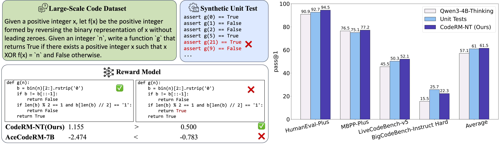
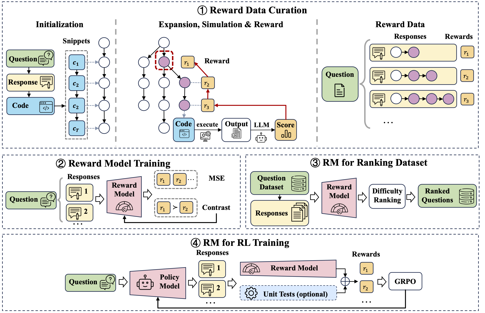

# CodeRM-NT: Reward Model for Code RL without Unit Tests

<p align="center">
  
</p>

<p align="center">
  <b>Left:</b> Synthetic unit tests can produce unreliable rewards, while CodeRM-NT correctly ranks code quality.<br>
  <b>Right:</b> Qwen3-4B-Thinking trained with CodeRM-NT outperforms synthetic unit tests on most benchmarks.
</p>

<p align="center">
  <a href="https://github.com/THUDM/CodeRM-NT"></a>
  <a href="assets/CodeRM-NT.pdf"></a>
  <a href="https://huggingface.co/Rishubi/CodeRM-NT"></a>
</p>

## Overview

Providing accurate reward signals for code generated by LLMs is a significant challenge in applying reinforcement learning (RL) to code generation. Existing methods rely on unit tests, which are expensive to curate and unreliable when automatically synthesized.

**CodeRM-NT** is a code reward model with **no reliance on unit tests**. Instead of executing test cases, it learns to estimate the functional correctness of generated Python code from rewards that are collected via Monte Carlo Tree Search (MCTS) guided by LLM-as-a-Judge. Training Qwen2.5-Coder, GLM-4-9B-0414, and Qwen3-4B-Thinking with CodeRM-NT consistently outperforms synthetic unit-test rewards on HumanEval(+), MBPP(+), LiveCodeBench-v5, and BigCodeBench-Instruct-Hard.


<p align="center">
  
</p>

## Key Results

Training with CodeRM-NT consistently outperforms synthetic unit tests and other reward models across multiple code generation benchmarks:

| Model              | Reward        | HumanEval | HumanEval+ | MBPP | MBPP+ | LCB-v5 | BCB-I-Hard |   Avg.   |
| :----------------- | :------------ | :-------: | :--------: | :--: | :---: | :----: | :--------: | :------: |
| Qwen2.5-Coder-1.5B | Unit Tests    |   73.2    |    67.7    | 70.9 | 61.1  |  5.1   |    6.1     |   47.4   |
|                    | **CodeRM-NT** |   75.0    |    69.5    | 72.0 | 60.8  |  5.5   |    7.4     | **48.4** |
| Qwen2.5-Coder-3B   | Unit Tests    |   86.6    |    82.3    | 74.9 | 64.6  |  13.0  |    15.5    |   56.2   |
|                    | **CodeRM-NT** |   88.4    |    82.3    | 75.9 | 66.1  |  13.6  |    14.2    | **56.8** |
| Qwen2.5-Coder-7B   | Unit Tests    |   90.9    |    87.8    | 85.4 | 73.0  |  17.3  |    18.2    |   62.1   |
|                    | **CodeRM-NT** |   90.2    |    86.0    | 86.8 | 74.6  |  17.5  |    18.2    | **62.2** |
| GLM-4-9B-0414      | Unit Tests    |   84.1    |    79.9    | 81.0 | 69.0  |  15.4  |    15.5    |   57.5   |
|                    | **CodeRM-NT** |   87.2    |    81.7    | 79.9 | 67.2  |  15.3  |    18.2    | **58.3** |
| Qwen3-4B-Thinking  | Unit Tests    |   97.6    |    92.7    | 91.0 | 75.1  |  50.3  |    25.7    |   72.1   |
|                    | **CodeRM-NT** |   97.6    |    94.5    | 92.6 | 77.2  |  52.1  |    22.3    | **72.7** |

## Getting Started

### Requirements

- Python 3.10+
- PyTorch 2.0+
- CUDA-capable GPUs (8x A100 80GB recommended)
- Docker

For MCTS, reward model training, and TRL-based RL, run:

```bash
pip install -r requirements.txt
```

For Slime-based training, using the provided Docker image is recommended:

```bash
docker run --rm --gpus all --shm-size=16g -it slimerl/slime:latest /bin/bash
```

### Step 1: Reward Data Curation via MCTS

See [mcts/README.md](mcts/README.md) for the full pipeline.

### Step 2: Train CodeRM-NT

See [rm_train/README.md](rm_train/README.md).

### Step 3: RL

For the reward model, use our published [`Rishubi/CodeRM-NT`](https://huggingface.co/Rishubi/CodeRM-NT) or use the model trained in Step 2.

- **TRL** (Qwen2.5-Coder on KodCode-V1): see [rl_train_trl/README.md](rl_train_trl/README.md).
- **slime** (Qwen3-4B-Thinking, GLM-4-9B-0414 on OCI/KodCode): see [rl_train_slime/README.md](rl_train_slime/README.md).

## Citation

TODO

## Acknowledgements

- Built on [Qwen2.5-Coder-Instruct](https://huggingface.co/collections/Qwen/qwen25-coder), [GLM-4-9B-0414](https://huggingface.co/zai-org/GLM-4-9B-0414), and [Qwen3-4B-Thinking-2507](https://huggingface.co/Qwen/Qwen3-4B-Thinking-2507) base models.
- Uses [huggingface/trl](https://github.com/huggingface/trl) and [THUDM/slime](https://github.com/THUDM/slime) for RL training.
- Uses [Magicoder-OSS-Instruct-75K](https://huggingface.co/datasets/ise-uiuc/Magicoder-OSS-Instruct-75K) to curate reward data and [KodCode-V1](https://huggingface.co/datasets/KodCode/KodCode-V1) and [OpenCodeInstruct](https://huggingface.co/datasets/nvidia/OpenCodeInstruct) for RL.
